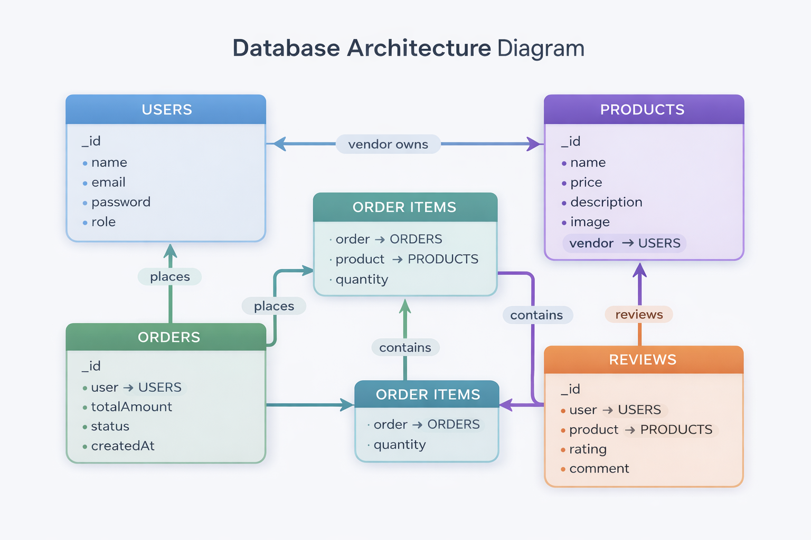

# 🛍️ Artisan's Corner – Multi-Vendor Marketplace

A full-stack e-commerce marketplace where artisans can sell handcrafted products and buyers can purchase them seamlessly.

---

## 🚀 Features

### 👤 Authentication
- User Registration & Login (JWT based)
- Role-based system (Buyer / Vendor)

### 🛒 Products
- Vendors can add, edit, delete products
- Image upload using Cloudinary
- Public product listing page

### 🧑‍💼 Vendor Dashboard
- View own products
- Manage inventory

### 🛍️ Cart
- Add to cart
- Update quantity
- Remove items
- Persistent cart using Context API + localStorage

### 💳 Payments
- Stripe Checkout integration
- Secure card payments

### 📦 Orders
- Order creation after checkout
- View order history

---

## 🛠️ Tech Stack

**Frontend:**
- React.js
- Context API
- Axios

**Backend:**
- Node.js
- Express.js

**Database:**
- MongoDB (Mongoose)

**Services:**
- Cloudinary (Image Upload)
- Stripe (Payments)

## 🧬 Database Architecture


This diagram represents the relationships between users, products, orders, and reviews in a multi-vendor marketplace system.


## 🧪 Demo Credentials

### 👤 Buyer
Email: testbuyer@gmail.com  
Password: 123456  

### 🧑‍💼 Vendor
Email: testvendor@gmail.com  
Password: 123456  

## 💡 Future Improvements

- Webhook-based payment verification
- Vendor analytics dashboard
- Review & rating system

---

## ⚙️ Setup Instructions

### 1. Clone repo
```bash
git clone https://github.com/your-username/artisans-corner.git
cd artisans-corner